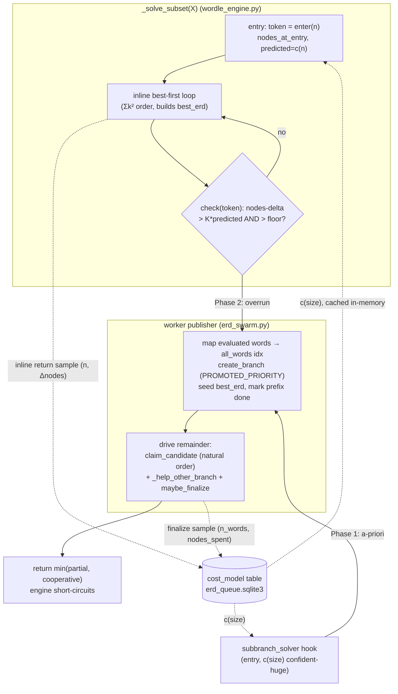

# Adaptive work decomposition for the ERD swarm

## Context

The ERD precache swarm decomposes work with two static, count-based guesses:

- **Fixed chunks.** A branch's ranked candidate list is sliced into contiguous
  chunks (`ERDQueue.chunk_size_for`, erd_queue.py:399). Because the ranking is
  best-first (`rank_candidates_by_max_group_size_then_entropy_gain`), every
  expensive head candidate lands in chunk 0, so one worker monopolizes the costly
  work while others devour the cheap tail and stall.
- **A hardcoded promotion size.** A sub-branch is promoted to cooperative solving
  only when `len(words) >= PROMOTE_MIN_SIZE` (60) (`_subbranch_solver`,
  erd_swarm.py:464). Once a sub-branch commits to inline solving, the engine
  grinds it to completion no matter how wrong that size estimate was — the source
  of multi-minute single-worker stalls.

Both use *count* as a proxy for *cost*, which it isn't: cost is heavy-tailed and
depends on a branch's substructure, not its size.

This plan replaces both with **one mechanism applied at every recursion level**:
when solving a branch overruns its predicted work, publish that branch's
*unevaluated candidate remainder* to the swarm for cooperative help, carrying the
partial `best_erd` bound. Promotion is driven by an online cost model `c(size)`
(expected recursion-nodes to solve a branch of `n` words). Outcome: runaway solves
recruit help at their own level, cheap solves stay single-threaded with zero
coordination, and existing ERD pruning is preserved.

**Two decisions locked in this session, grounding the design:**

1. **Publish the remainder over the shared natural word-list order — not a ranked
   slice.** Ranking is a *local* concern (it builds a tight bound fast on a single
   worker) and is *anti-correlated* with parallel scalability (best-first piles the
   expensive candidates into the head). The published remainder therefore needs no
   ranking and no cross-worker order agreement: claims index directly into the
   shared `all_words` list (every worker loads identical `wordle.txt`). The
   publisher marks its already-evaluated candidates *done* by their `all_words`
   index, and helpers claim the rest. This drops `rank_candidates_…`/`_ranked_for`
   out of the parallel claim path entirely, and the already-computed prefix work
   (and the tight bound it produced) is never recomputed.

2. **Full rename to candidate-claim vocabulary now** (`branch_chunks` →
   `candidate_claims`, `idx` = candidate index, the claim atom is one candidate).

**Start by merging `origin/main` into the working branch** (`claude/refine-local-plan-nnkcmz`
is behind). `_help_other_branch` (erd_swarm.py:439 on main) — the waiting-worker
recruiter that drains any open branch when a worker's own branch is fully claimed —
already exists there and is reused below.

---

## The one mechanism

A unit of work is a `_solve_subset(X)` call. At every such call:

- Record frame-local `nodes_at_entry` (= the worker's live `self._nodes`) and
  `predicted = c(len(X))`.
- Solve depth-first, best-first, **single-threaded**, building a tight `best_erd`.
- Two trigger points publish X's remaining candidates as a cooperative branch over
  natural `all_words` order, carrying the partial `best_erd` as the bound:
  - **Entry (a-priori):** if `c(len(X))` confidently predicts X is huge, publish
    immediately. This is the existing `subbranch_solver` hook
    (wordle_engine.py:1121), retargeted from `len < 60` to a `c(size)` threshold.
  - **Mid-loop (overrun):** after each candidate, if
    `self._nodes - nodes_at_entry > OVERRUN_K * predicted` *and* the predicted
    remaining work clears an absolute node floor, publish the remainder now.
- Once published, this worker drives X to finalize cooperatively (reusing
  `cooperative_solve`'s claim/help/finalize loop); the result is
  `min(partial best, cooperative best)`, returned to the engine so it
  short-circuits (mirrors the `subbranch_solver` short-circuit at
  wordle_engine.py:1123-1126).

**Same-level, not one deeper.** Overrun is a *horizontal* deficit ("X's candidate
list is more work than one worker can carry"), so the response is horizontal help
at X's level. A single tarpit candidate C is handled by the same mechanism
recursively: evaluating C recurses into `_solve_subset(S)` for its expensive
sub-branch S, which overruns at *S's* level and publishes S's remainder.

**Absolute-cost floor.** Publish only when predicted *remaining* work exceeds a
coordination break-even (a node count), in addition to the trigger. The ratio
detects surprise; the floor ensures the surprise is worth parallelizing.

### Why remainder-over-natural-order is correct and cheap

- The swarm is always `ERD_ALL`, so a branch's candidate list is always the full
  `all_words` (12,972). Natural file order is shared identically by every worker —
  no ranking, no re-rank-and-agree requirement (replaces the erd_queue.py:93-95
  invariant).
- The publisher has evaluated a prefix in its *local* Σk² order
  (wordle_engine.py:1133, unchanged for inline solving). It maps each evaluated
  candidate **word → `all_words` index** (one dict built once on the worker) and
  marks those indices done (`complete_chunk`/`complete_candidate`), after seeding
  the branch best with the partial `(best_guess, best_erd)`.
- Helpers claim remaining indices one at a time and evaluate `all_words[idx]`.
  Because the carried bound is already tight, they prune hard from their first
  candidate ("lazy publication protects pruning"), so the lack of best-first order
  in the parallel path costs little.

### Underrun (prediction too high)

Asymmetric by design — overrun is severe (a worker stalls) and gets a *runtime*
response (publish); underrun is mild (a few redundant single-candidate claims on a
branch that finalizes fast) and gets only a *learning* response (feed the cheap
sample back). The single-candidate atom makes claim-level underrun benign: a worker
can never be stuck holding a unit that turned out cheap. Lean toward
under-promoting: set the entry bar conservatively (publish only when `c(size)` is
far above break-even); when in doubt, solve inline and let overrun catch it. No live
un-publish. A size bucket that keeps finishing cheap pulls `c(size)` down via
time-weighted sampling until it stops being entry-promoted.

---

## Pruning safety — invariants the implementer MUST preserve

- **Vertical budget pruning unchanged.** `sub_budget = budget - 1`
  (wordle_engine.py:996) and the `cost >= best_erd` cutoff (wordle_engine.py:1052)
  stay exactly as they are.
- **Sibling response groups stay sequential — in this plan.** A candidate's
  response groups are solved one at a time, largest first
  (wordle_engine.py:999-1053), each seeing the accumulated cost tightened by its
  predecessors so the candidate aborts early once its partial sum reaches `best_erd`.
  This plan does **not** parallelize them, and the engine seam below only ever
  publishes the *candidate list of one branch*, never the *response groups of one
  candidate*. This is a scope boundary, **not** a correctness prohibition: a
  candidate's cost is the order-independent sum of its groups, so groups *could* be
  parallelized by the same claim-and-carry-a-bound mechanism. The reason to defer is
  that doing so trades away the inter-sibling early-abort pruning — exactly the same
  class of pruning-vs-parallelism tradeoff we make at the candidate level, but a
  *distinct* decision with its own break-even. It belongs to the later
  clustering/granularity investigation (see Instrumentation), not here.
- **Carry the partial bound.** The partial `best_erd` MUST be seeded into the
  published branch (`create_branch` + `update_branch_best`) so helpers prune from
  their first evaluation. Strictly better than today's eager chunking, which starts
  cold workers before any bound exists.
- **No cancellation of in-flight cooperative subtrees.** The swarm solves to exact
  optimum for caching (`cutoff=False`). Do not add subtree cancellation.

---

## Cost model `c(size)`

- **Unit: recursion nodes.** `self._nodes` (erd_swarm.py:115) already counts nodes
  (incremented once per node inside `_heartbeat`, erd_swarm.py:245). Load-independent
  measure of work; no wall-clock conversion needed.
- **Storage: `erd_queue.sqlite3` (Linux-only).** A cost model is local state. New
  table via the stateless check-then-add pattern in `ERDQueue._migrate`
  (erd_queue.py:143) — no `schema_migrations` table here.

  ```sql
  CREATE TABLE IF NOT EXISTS cost_model (
      size_bucket  INTEGER PRIMARY KEY,
      weighted_sum REAL NOT NULL,
      weight_sum   REAL NOT NULL,
      last_updated INTEGER NOT NULL
  );
  ```
- **Exponential time-weighting (core requirement — `c(size)` must adapt as the
  search algorithm changes).** Each sample's influence decays with age so the model
  tracks the *current* structure of the work, not a stale all-time average. On
  update with sample `x` at `now`: `decay = exp(-(now - last_updated)/TAU)`;
  `weighted_sum = weighted_sum*decay + x`; `weight_sum = weight_sum*decay + 1`;
  estimate = `weighted_sum/weight_sum`; `last_updated = now`. `TAU` ≈ one day of
  seconds sets the half-life (≈ how often the engine's cost structure shifts;
  tunable). This is an EMA in continuous time — old samples fade smoothly, a changed
  algorithm re-converges within ~`TAU`.
- **Size bucketing.** Bucket `n_words` geometrically (e.g.
  `floor(log(n)/log(1.3))`) so samples stay dense in the heavy small-size region;
  interpolate across neighbouring buckets for unseen sizes. Return `None` below a
  minimum `weight_sum` (cold).
- **Cold-start stochastic probing (fast convergence).** When a bucket is cold and a
  branch of that size is about to be solved, don't wait for organic samples to
  trickle in. Take a *stochastic sample of roughly `2 × worker_count` candidates*
  from the branch's `all_words` list (uniform random indices), evaluate just those
  to get per-candidate node costs, and seed the bucket from that sample (the
  branch-solve estimate ≈ per-candidate mean × `n_candidates`, plus the recursion
  these probes already triggered). `2 × worker_count` is enough to get a usable mean
  cheaply while naturally scaling the probe cost to available parallelism — the
  probes themselves are independent and can be claimed by the swarm. This collapses
  the cold → warm transition from "many full branch solves" to "one probe round,"
  so entry-publication decisions are well-informed almost immediately after an
  algorithm change empties the model.
- **In-memory cache on the worker.** Reading the model per frame would be thousands
  of DB reads. Load all buckets into a dict on the worker and refresh on a timer
  (reuse the `BEST_REFRESH_SECONDS` cadence pattern, erd_swarm.py:45). `c(size)`
  reads this dict; writes go straight to the table (batched, below).
- **Hybrid use.** Entry publication uses a *confident-huge* threshold (`c(size)` far
  above break-even). Overrun uses `predicted = c(len(X))` as the per-frame budget.
  Cold model → fall back to today's behaviour (`PROMOTE_MIN_SIZE = 60` as the entry
  bootstrap prior; no overrun trigger until a prediction exists).

### Sampling (trains itself)

- **Inline frame returns (primary, dense):** on every inline `_solve_subset(X)`
  return, record `(len(X), self._nodes - nodes_at_entry)`. Accurate (one worker did
  all the nodes); covers small/medium sizes abundantly. **Batch** these in memory
  and flush on the heartbeat path (erd_swarm.py:239) to avoid per-frame writes.
- **Cooperative finalize (large sizes):** add a `nodes_spent` column to
  `active_branches`, accumulate per-claim node deltas into it via the heartbeat
  path, and record `(n_words, nodes_spent)` in `maybe_finalize` (erd_swarm.py:404).
  Covers sizes solved across multiple workers, where a single frame's local delta
  undercounts.

---

## Instrumentation for the clustering decision

Single-candidate claiming is a deliberate simplification (decision #1 this session):
it is correct and order-free, but one claim transaction per candidate means DB
coordination is now frequent and may, for cheap candidates, cost more than the
candidate evaluation it guards. We do **not** guess at clustering now; instead this
plan instruments the running swarm so a later, data-driven decision can define what a
clustered work unit should be. This is exploratory telemetry, separate from the
`cost_model` (which drives runtime decisions) — keep it in its own Linux-only table
so it can be dropped without touching the live model.

**What to record** (one row per claim, sampled/throttled to bound write cost — e.g.
every Nth claim — written via the heartbeat batch path, never per-claim synchronously):

- `coordination_nanos` — wall time spent in the claim transaction itself
  (`claim_candidate` `BEGIN IMMEDIATE` → commit), i.e. the parallelization overhead.
- `work_nodes` — recursion nodes the claimed candidate actually cost (the live
  `self._nodes` delta), i.e. the useful work that overhead bought.
- `n_words`, `claim_retries`/contention indicator, `worker_count` at the time — so
  overhead can be read against branch size and live parallelism.

**Why these** — they make the central ratio observable:
`overhead_fraction = coordination_nanos / (coordination_nanos + work_node_time)`.
This is the quantity that decides whether clustering pays. We also capture, per
branch, the *distribution* of `work_nodes` across candidates (cheap-tail vs
expensive-head spread), because that distribution determines what a good cluster
*is* — uniform cheap candidates cluster trivially; a few heavy candidates among many
cheap ones argue for size-balanced rather than fixed-count clusters.

**How to evaluate it** — after a representative precache run, read the table to
answer: (a) what is the median/p90 `overhead_fraction`, and for which sizes does it
exceed a break-even (say > 0.1, i.e. coordination eats > 10% of throughput)? (b)
within a branch, how skewed is `work_nodes` — would clustering K adjacent candidates
balance load or just re-create a chunk-0 monopoly? (c) does `overhead_fraction` rise
with `worker_count` (contention) or stay flat (pure transaction cost)? Clustering is
justified only where (a) shows real overhead AND (b) shows the costs are clusterable
without re-introducing imbalance. The same telemetry informs the deferred
group-level parallelization question (sibling response groups, above): both are
"what is the right granularity of a work unit" decisions, and this data is what makes
either one answerable instead of speculative.

## Queue changes (`erd_queue.py`) — full rename

- **Retire chunk sizing.** Delete `chunk_size_for`, `n_chunks_for`, `chunk_range`
  and the `min_words_per_chunk` / `max_chunk_count` policy. The claim atom is one
  candidate; `n_candidates` is the claim count.
- **Rename `branch_chunks` → `candidate_claims`** (`idx` = candidate index into
  `all_words`) via an idempotent `ALTER TABLE … RENAME TO` migration in `_migrate`,
  following the existing rename pattern (erd_queue.py:206-230). Update the table
  comment to current state (per CLAUDE.md comment rules — describe what it *is*).
- **Rename the claim methods** consistently: `claim_chunk` → `claim_candidate`,
  `complete_chunk` → `complete_candidate`, `branch_done_chunks` →
  `branch_done_candidates`, `reclaim_stale_chunks` → `reclaim_stale_claims`,
  `reclaim_chunks_of_worker` → `reclaim_claims_of_worker`. Logic is unchanged:
  `claim_candidate` still "claims the lowest-indexed slot with no row"
  (erd_queue.py:459) — with one candidate per slot it is single-candidate claiming
  with no other change. Keep `BEGIN IMMEDIATE`, stale-claim reclaim, and the
  finalize-on-full-coverage check.
- **`active_branches`:** drop the `chunk_size` column (or fix it at 1); the claim
  count is `n_candidates`. Add `nodes_spent INTEGER` (cost-model sampling). Both via
  idempotent migration.
- **`claim_telemetry` table** (exploratory, separate from `cost_model`; see
  Instrumentation): `(n_words, coordination_nanos, work_nodes, claim_retries,
  worker_count, recorded_at)`, written throttled via the heartbeat batch path. Safe
  to drop independently of the live model.
- **Heartbeat columns:** rename `chunk_idx` → `claim_idx`, `chunk_started_at` →
  `claim_started_at`, `chunks_done` → `claims_done`, `cand_chunk_size` →
  `claim_total` (or drop, now always 1) via `RENAME COLUMN` migrations; thread the
  new names through `heartbeat()` and `heartbeats_with_branch()`.
- **Lazy registration.** Branches are NOT pre-registered. A branch becomes a
  `candidate_claims` set only when published (entry or overrun). Top-level
  user-queued branches are huge, so `c(size)` entry-publishes them immediately;
  smaller sub-branches solve inline until they overrun.
- Honest tradeoff: one claim transaction per candidate is more DB traffic than
  chunking. Accepted deliberately — correctness now, clustering later only if
  performance data justifies it. Do not reintroduce grouping.

---

## Engine seam (`wordle_engine.py`)

- **Keep** the entry `subbranch_solver` hook (wordle_engine.py:1121-1126);
  `_subbranch_solver` (erd_swarm.py:464) switches from `len(words) < 60` to a
  `c(size)` threshold with cold-start fallback to `PROMOTE_MIN_SIZE`.
- **Add a `mid_loop_publisher` parameter**, threaded through `_solve_subset` *and*
  `evaluate_candidate` exactly like `subbranch_solver` is (it cannot reuse
  `progress_callback`, which is deliberately top-level-only — passed as `None` into
  recursion at wordle_engine.py:1034). It is a worker-bound callable (the engine has
  no `self`; `self._nodes` lives on the worker):
  - At `_solve_subset` entry: `token = mid_loop_publisher.enter(n)` → returns
    `(nodes_at_entry, predicted)` or `None` (cold model / below floor → no overrun
    check this frame). `enter` reads the worker's `self._nodes` and cached `c(n)`.
  - In the candidate loop (after the `best_erd` update, wordle_engine.py:1166): if
    `token` is set, call `mid_loop_publisher.check(token, evaluated_words,
    best_guess, best_erd, budget)` where `evaluated_words = candidate_list[:i+1]`.
    `check` reads `self._nodes`, tests `delta > OVERRUN_K * predicted` and the node
    floor; if tripped it registers X as a cooperative branch (prefix marked done,
    bound seeded), drives it, and returns the finished `(cost, md, floor, cutoff)`
    tuple — the engine returns it immediately. Else returns `None`.
- Frame-local `token` is a plain local, so each active frame on the DFS stack checks
  its own overrun independently ("get help at my level"). Nodes spent driving an
  inner publication inflate outer frames' deltas — benign (the outer frame is also
  expensive and may legitimately publish next).
- The inline candidate sort (Σk², wordle_engine.py:1133) is **unchanged** — it
  builds the local bound. Only the *published* remainder uses natural order.

---

## Swarm changes (`erd_swarm.py`)

- `_subbranch_solver`: `c(size)` entry threshold + cold-start `PROMOTE_MIN_SIZE`
  fallback.
- New `mid_loop_publisher` (object/closure passed to the engine) implementing
  `enter`/`check`; on trip it builds the published branch over `all_words`, maps
  evaluated words → `all_words` indices via a prebuilt `{word: idx}` map, marks
  those done, seeds the bound, then runs `cooperative_solve`'s claim/help/finalize
  loop on the remainder.
- `cooperative_solve` and the renamed `evaluate_chunk` (→ `evaluate_claim`) operate
  over `self.all_words` in natural order at `chunk_size = 1` (one candidate per
  call), dropping `_ranked_for`/`rank_candidates_…` from the swarm claim path.
- Reuse `_help_other_branch` (erd_swarm.py:439, from main) unchanged for the
  idle/waiting recruiter; published branches keep `PROMOTED_PRIORITY` so freed
  workers join them first.
- `maybe_finalize`: record the cooperative-branch cost sample `(n_words,
  nodes_spent)`.
- Constructor / `swarm_worker` signature: drop `min_words_per_chunk` /
  `max_chunk_count`.
- Display: `node_rate` is already surfaced in erd_search.py (lines 1048, 1077 —
  `kN/s`); only the now-vestigial `cand_rate` heartbeat argument needs cleaning up.

---

## CLI / supervisor (`erd_search.py`)

- Remove `--min-words-per-chunk` / `--max-chunk-count` args and their plumbing into
  `swarm_worker` (erd_search.py:600-603, 696). Update the supervisor start log.
- Display already uses `node_rate`; no display change required (verify only).

---

## Flow & phasing



- **Phase 1 — foundation.** Cost model `c(size)` (table, time-decay, in-memory
  cache, read/update); exponential time-weighting and cold-start stochastic probing
  (`2 × worker_count` samples); node sampling (inline returns + cooperative
  finalize); single-candidate claiming over natural `all_words` order (retire chunk
  sizing, full rename to `candidate_claims`); `claim_telemetry` instrumentation;
  hybrid **entry** publication via `c(size)` replacing `PROMOTE_MIN_SIZE`. Delivers:
  no chunk-0 monopoly, accurate size-driven promotion, and the data to later decide
  clustering granularity.
- **Phase 2 — overrun escape hatch.** The `mid_loop_publisher` engine seam:
  same-level lazy publication on overrun, with prefix-marked-done so the expensive
  head is never recomputed. The heart of the inline-tarpit fix; sequenced after the
  foundation because it carries the engine-core change.

---

## Constants (tunable; name them, give starting values)

- `OVERRUN_K` ≈ 4 (overrun ratio).
- `MIN_PUBLISH_NODES` — absolute remaining-work floor for any publication.
- Entry confident-huge multiple over break-even.
- `TAU` ≈ 1 day of seconds; `COST_MODEL_MIN_WEIGHT` for cold→`None`.
- `PROMOTE_MIN_SIZE = 60` retained only as the cold-start bootstrap prior.

## Files

- `erd_queue.py` — `cost_model` table + read/update; `nodes_spent` column; full
  rename `branch_chunks` → `candidate_claims` and the claim methods; drop chunk
  sizing; heartbeat column renames.
- `erd_swarm.py` — `c(size)` entry threshold; `mid_loop_publisher`; per-candidate
  natural-order `cooperative_solve`/`evaluate_claim`; cost sampling; constructor
  signature.
- `wordle_engine.py` — `mid_loop_publisher` param threaded through `_solve_subset`
  + `evaluate_candidate`; frame-local overrun state; inline sort untouched.
- `erd_search.py` — drop chunk-sizing CLI args + plumbing; verify node-rate display.

## Reuse (do not reinvent)

- `cooperative_solve` / `_subbranch_solver` / engine hook (wordle_engine.py:1121).
- `_help_other_branch` (erd_swarm.py:439, from main) — idle recruiter.
- `claim_one` join-first scheduling (erd_swarm.py) + `PROMOTED_PRIORITY`.
- `self._nodes` + `_heartbeat` node counter (erd_swarm.py).
- `claim_candidate`/`reclaim_stale_claims`/finalize-on-full-coverage (renamed).
- Queue patterns: `create_branch`, `update_branch_best`, `get_branch`,
  `_migrate` idempotent check-then-add / RENAME loop.

## Verification

- **Unit** (`test_erd_queue_unit.py`, `test_erd_swarm_unit.py`, `test_erd_parallel.py`,
  `test_erd_scaling.py`): cost-model UPSERT + time-decay with synthetic timestamps
  (assert an old sample's weight decays toward zero and a changed regime
  re-converges within ~`TAU`); cold (`None`) vs warm read; cold-start probe takes
  ~`2 × worker_count` samples and seeds the bucket; entry threshold
  promotes/inlines correctly for a seeded model; overrun `check` fires per frame on
  a forced node delta; single `candidate_claims` claim/reclaim/finalize;
  prefix-marked-done leaves only the remainder claimable; samples recorded from
  inline returns and cooperative finalize; a throttled `claim_telemetry` row is
  written with sane `coordination_nanos`/`work_nodes`. Update/remove the `chunk_size_for` tests (test_erd_queue_unit.py:55-67,
  test_erd_swarm_unit.py:290/358/396, test_erd_scaling.py:72/266,
  test_erd_parallel.py:65) and `PROMOTE_MIN_SIZE` tests
  (test_erd_swarm_unit.py:129-142).
- **Pruning-safety regression:** assert sibling response groups stay sequential;
  solve a small fixed branch both the old (`PROMOTE_MIN_SIZE`) and new path and
  confirm **identical finalized ERD** and that total nodes are not worse.
- **Full suite:** `python -m unittest discover -s . -p 'test_*.py'` — green before
  any commit (CLAUDE.md).
- **End-to-end smoke:** small swarm on a known branch; confirm (a) candidates spread
  one-at-a-time with no chunk-0 monopoly, (b) a deliberately mispredicted-cheap
  tarpit sub-branch publishes mid-solve and is picked up by `_help_other_branch`
  rather than stalling one worker, (c) finalized ERD matches the pre-change value.

## Rollout

- Stop running systemd workers before deploying (stale workers against changed
  schema/engine corrupt the cache — established rule).
- `erd_queue.sqlite3` migrations are idempotent and Linux-only; no phone
  coordination (unlike `wordle_cache.sqlite3` schema changes).
