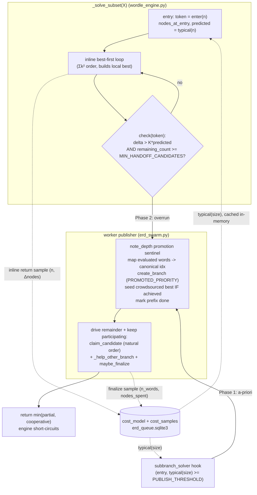

# Adaptive work decomposition for the ERD swarm

> **Executor note.** This plan is written to be executed by an agent with an
> empty context window. It cites code by **symbol name first**; any line numbers
> are **approximate** (the tree drifts) — navigate by searching for the named
> function/table/column. Run the full test suite (`python -m unittest discover -s
> . -p 'test_*.py'`) green before every commit, per `CLAUDE.md`. The
> `erd_queue.sqlite3` schema is Linux-only; all its migrations are idempotent and
> need no phone coordination (unlike `wordle_cache.sqlite3`).

## Context

The ERD precache swarm decomposes work with two static, count-based guesses:

- **Fixed chunks.** A branch's ranked candidate list is sliced into contiguous
  chunks (`ERDQueue.chunk_size_for`). Because the ranking is best-first
  (`rank_candidates_by_max_group_size_then_entropy_gain`), every expensive head
  candidate lands in chunk 0, so one worker monopolizes the costly work while
  others devour the cheap tail and stall.
- **A hardcoded promotion size.** A sub-branch is promoted to cooperative solving
  only when `len(words) >= PROMOTE_MIN_SIZE` (60), in `ERDSwarmWorker._subbranch_solver`.
  Once a sub-branch commits to inline solving, the engine grinds it to completion
  no matter how wrong that size estimate was — the source of multi-minute
  single-worker stalls.

Both use *count* as a proxy for *cost*, which it isn't: cost is heavy-tailed
(empirically near log-normal) and depends on a branch's substructure, not its
size.

This plan replaces both with **one mechanism applied at every recursion level**:
when solving a branch overruns its predicted work, publish that branch's
*unevaluated candidate remainder* to the swarm for cooperative help, carrying the
partial best as a crowdsourced bound. Promotion is driven by an online cost model
that yields `typical(size)` — a **robust** estimate (not the mean) of the
recursion-node cost to solve a branch of `n` words. Outcome: runaway solves
recruit help at their own level, cheap solves stay single-threaded with zero
coordination, and existing ERD pruning is preserved.

### Decisions grounding the design

1. **Publish the remainder over the shared natural word-list order — not a ranked
   slice.** Ranking is a *local* concern (it builds a tight bound fast on one
   worker) and is *anti-correlated* with parallel scalability (best-first piles the
   expensive candidates into the head). The published remainder needs no ranking
   and no cross-worker order agreement: claims index directly into the shared
   `all_words` list (every worker loads identical `wordle.txt`). The publisher
   marks its already-evaluated candidates *done* by their `all_words` index;
   helpers claim the rest. This drops `rank_candidates_…` / `_ranked_for` out of
   the parallel claim path entirely, and the already-computed prefix (and the tight
   bound it produced) is never recomputed.

2. **The claim atom is one candidate.** Full rename of all "chunk" vocabulary to
   "claim" vocabulary, in code *and* comments (see the rename section). The work
   unit is no longer a chunk; the language must follow.

3. **Lean toward over-promotion, not under-promotion.** A false positive (promote
   something that was actually cheap) costs a few single-candidate claim
   transactions — cheap, and *measured* by `claim_telemetry`. A false negative (fail
   to promote a tarpit) is a single worker stalling for minutes — the exact bug
   this project exists to kill. The asymmetry runs toward publishing eagerly. This
   **reverses** the "lean toward under-promoting" stance of earlier drafts, which
   was inconsistent with the problem statement.

4. **Telemetry is outbound-only.** `claim_telemetry` signals to an external
   monitor and to offline analysis. It is **never** a runtime feedback input. No
   runtime decision reads it. It is freely droppable.

**Prerequisite:** merge `origin/main` into the working branch first.
`_help_other_branch` — the waiting-worker recruiter that drains any open branch
when a worker's own branch is fully claimed — already exists on main and is
adapted below.

---

## Phase 0 — Result-protocol cleanup (foundation, behavior-preserving)

The engine core (`_solve_subset`, `evaluate_candidate` in `wordle_engine.py`)
currently encodes *why* a search failed to return an exact optimum by overloading
`None` and inferring meaning from combinations of `(cost == inf, floor, cutoff)`.
The word **"cutoff" names the result, not the reason** — was the work abandoned
because it blew the depth budget, or because a better ERD made it unable to
improve on the known bound? Those are different facts the cache must treat
differently, and the names must say which.

Replace the overloaded returns with **explicit, reason-named statuses**. Anchor on
the `CLAUDE.md` rule: *a name must include all essential context.* Recommended
spellings (executor may refine, but each must name the **reason**):

| Today (inferred) | Reason | Recommended status |
|---|---|---|
| `return None` (deadline check) | the wall-clock deadline passed | `DEADLINE_EXCEEDED` |
| `return None` (`cancel_check` fired) | an **external** stop signal was received — in the swarm this is the `stop_event` (worker shutdown/recycle) | `CANCEL_RECVD` |
| exact optimum tuple | the true minimum was found | `SOLVED` |
| `(inf, None, True, False)` | depth budget too small — *proven* no winning strategy | `OVER_DEPTH_BUDGET` |
| `(ceiling, None, _, True)` (`cutoff=True`) | every candidate priced ≥ the known ERD bound — *lower bound only, do not cache* | `OVER_ERD_LIMIT` |

The two `return None` cases are detected at **separate sites** (the deadline
comparison vs. the `cancel_check()` call), so they become two distinct statuses,
not one lumped "aborted" — each names its own cause.

`evaluate_candidate`'s status strings (`'ok'`, `'cutoff'`, `'pruned'`, `'useless'`,
`'abort'`) get the same treatment: `'cutoff'` → `OVER_ERD_LIMIT`, `'pruned'` →
`OVER_DEPTH_BUDGET`, `'useless'` → a reason-named constant (e.g. `NO_INFORMATION`
— the split is `k >= n`, zero information gain), `'abort'` → propagate whichever of
`DEADLINE_EXCEEDED` / `CANCEL_RECVD` the inner frame reported, `'ok'` → `SOLVED`.

The depth-floor **taint** (the property that makes a `SOLVED` result valid only at
*this* budget, currently the `floor` boolean threaded everywhere) becomes a
separate, explicitly-named `budget_tainted` flag carried alongside the status —
not inferred. The cache-reuse logic (`_cache_reuse`, `ScoreCache` reuse rule,
`maybe_finalize`'s tainted/`solve_budget` handling) reads the explicit flag.

**Constraints.**
- **Behavior-preserving.** No ERD value, cache entry, or pruning decision changes.
  The existing suite (`test_*.py`) is the oracle — it must stay green.
- **Blast radius — update every site that unpacks the engine's return; this is not a
  one-line rename.** `_solve_subset` returning status+payload instead of
  `(cost, md, floor, cutoff)` / `None` ripples to every destructuring caller. At
  minimum: `evaluate_candidate` (`sub_cost, sub_md, sub_floor, sub_cutoff = sub`, and
  its own `('status', …)` returns), `min_expected_guesses`, `_cache_reuse` and the
  `(*reuse, False)` spreads, and on the swarm side `cooperative_solve` (returns the
  4-tuple, `(*reuse, False)`) and `evaluate_chunk`/`evaluate_claim`. Grep for the
  tuple destructure and for `, False)` spreads before declaring Phase 0 done. The
  test changes are correspondingly more than renames.
- **Hot path.** `_solve_subset` is called millions of times. Use a lightweight
  status representation (an `IntEnum` / module-level int constants plus the payload),
  **not** a per-node object allocation. Do not regress node throughput.

Phase 0 ships independently and de-risks everything after it: once the cooperative
path's bound semantics are named explicitly, the Phase 2 reasoning below is
unambiguous.

---

## Two bounds — keep them distinct (critical for correctness)

There are **two different** branch-and-bound mechanisms in this engine. Conflating
them causes either lost pruning or a corrupt cache.

1. **Vertical alpha-beta `ceiling`** — passed *down* the recursion within one
   worker (`_solve_subset(..., ceiling=...)`, `sub_ceiling` in
   `evaluate_candidate`). A result that bottoms out against it is `OVER_ERD_LIMIT`:
   a **lower bound only**, solvability unknown, **never cached**.

2. **Horizontal crowdsourced bound** — `bound_provider` in `evaluate_chunk` reads
   the shared `active_branches.best_erd` (every `BEST_REFRESH_SECONDS`) and
   tightens pruning mid-evaluation across all workers on the same branch. This bound
   is a **real achieved value**, so pruning against it is exact and the result **is**
   cacheable. `active_branches.best_erd` is documented as, and must remain, a real
   achieved value.

A cooperatively-solved branch is finalized to the persistent cache as an exact
optimum (`maybe_finalize` → `score_cache.write`). Therefore a published branch
**carries no inherited vertical `ceiling`** (that would make its result a
non-cacheable lower bound) but **does** run under the crowdsourced bound. Workers
on a published branch trade their best-found ERD for early pruning through
mechanism 2 — that is how cooperative pruning already works, and the new
publication paths must preserve it by seeding the shared best (below).

---

## The one mechanism (Phases 1–2)

A unit of work is a `_solve_subset(X)` call. At every such call:

- Record frame-local `nodes_at_entry` (the worker's live `self._nodes`) and
  `predicted = typical(len(X))`.
- Solve depth-first, best-first, **single-threaded**, building a tight local best.
- Two trigger points publish X's remaining candidates as a cooperative branch over
  natural `all_words` order:
  - **Entry (a-priori, Phase 1):** if `typical(len(X)) >= PUBLISH_THRESHOLD`,
    publish immediately. This is the existing `subbranch_solver` hook, retargeted
    from `len < 60` to the cost-model gate.
  - **Mid-loop (overrun, Phase 2):** after each candidate, publish the remainder if

    ```
    self._nodes - nodes_at_entry  >  OVERRUN_K * typical(len(X))   # abnormal for its size
      AND  (n_candidates - (i + 1))  >=  MIN_HANDOFF_CANDIDATES     # enough left to be worth swarming
    ```

    The handoff floor is a **candidate count**, not `typical(remaining)`. `typical`
    is a function of branch *size* (word count), and the published remainder is the
    *same* branch X with the *same* `len(X)` — only its candidate list is being
    partitioned — so `typical` cannot be evaluated on "the remainder." Nor can the
    floor be a predicted-remaining-nodes figure: overrun only fires *after*
    `nodes_spent > OVERRUN_K * predicted`, so any `predicted - nodes_spent` estimate
    is already deeply negative exactly when overrun trips, and would suppress the
    publication it is meant to gate. We are by definition in a tarpit, so each
    unevaluated candidate is likely expensive; the only thing worth checking is that
    a non-trivial number remain unclaimed (`MIN_HANDOFF_CANDIDATES`, a small count,
    e.g. ≥ `2 × worker_count`).

- Once published, this worker keeps participating: it drives X to finalize
  cooperatively (reusing the claim/help/finalize loop); the result is
  `min(partial best, cooperative best)`, returned to the engine so it
  short-circuits (mirrors the existing `subbranch_solver` short-circuit).

**Gate and overrun share one `typical(size)`.** They differ only in the
*comparison*, never the statistic — so they cannot contradict each other (the gate
cannot say "fine inline" while overrun immediately says "too big" for the same
size). The gate asks "is this size *typically* big enough to swarm up front?"; the
overrun asks "is *this instance* running much hotter than typical for its size?"

**`PUBLISH_THRESHOLD` is adaptive too — the DB-coordination break-even, measured
online.** It is *not* a hardcoded node count. It answers "is the swarm worth it at
all": publishing pays only when the work handed off exceeds the cost of
coordinating the handoff. Both halves are measurable, so compute it the same way as
`typical(size)` — a time-weighted (same `TAU`) estimate, refreshed live:

- `coordination_nanos` — wall time of a claim transaction (`BEGIN IMMEDIATE` →
  commit), collapsed with the **same** log-domain EMA (robust median).
- `node_nanos` — wall time per recursion node (node throughput), same EMA.

Then `PUBLISH_THRESHOLD = SAFETY_FACTOR × coordination_nanos / node_nanos`
(node-equivalents — same unit as `typical(size)`). `SAFETY_FACTOR` (≈ 8) is a
dimensionless knob; `OVERRUN_K` (~3–5) likewise. Those two ratios and `TAU` are the
only constants — meta-parameters governing *how* we adapt, never the adapted
quantities. Until the coordination/throughput estimators warm, fall back to a cold
bootstrap `PUBLISH_THRESHOLD_BOOTSTRAP` (≈ 5 000 nodes), exactly as `typical(size)`
falls back to `PROMOTE_MIN_SIZE`.

> **Keep telemetry outbound-only.** The coordination/throughput measurements that
> feed this live threshold are taken into small **in-memory** online estimators on
> the worker — *not* read back out of the `claim_telemetry` table. `claim_telemetry`
> stays a pure outbound record (one measurement, two independent consumers: the
> in-memory estimator for control, a throttled telemetry row for the monitor). No
> control path ever queries the telemetry table.

**Same-level, not one deeper.** Overrun is a *horizontal* deficit ("X's candidate
list is more work than one worker can carry"), so the response is horizontal help
at X's level. A single tarpit candidate C is handled by the same mechanism
recursively: evaluating C recurses into `_solve_subset(S)` for its expensive
sub-branch S, which overruns at *S's* level and publishes S's remainder.

### Publishing — seeding the crowdsourced bound

- The publisher has evaluated a prefix in its *local* Σk² order (the inline sort,
  unchanged). It maps each evaluated candidate **word → `all_words` index** (one
  `{word: idx}` dict, built once on the worker) and marks those indices done, after
  seeding `active_branches.best_erd`/`best_guess` with the partial achieved
  `(best_guess, best_erd)`.
- **Seed the bound only if a real achieved best exists** (`best_guess is not
  None`). A non-achieved value (e.g. the frame's alpha-beta ceiling) must never be
  written into `active_branches.best_erd` — that would violate its "real achieved
  value" invariant and corrupt every reader's pruning.
- **Overrun may fire before any feasible candidate is found** (`best_guess is None`
  at trip time). In that case: publish the remainder with **no seeded bound**
  (helpers discover the bound themselves) and keep participating. This is just a
  refinement of "always participate in the swarm you request."
- Helpers claim remaining indices one at a time and evaluate `all_words[idx]`.
  Because the carried bound (when seeded) is already tight, they prune hard from
  their first candidate, so the lack of best-first order in the parallel path costs
  little.

### Why remainder-over-natural-order is correct and cheap

- The claim index space is the branch's **policy-canonical candidate list** — the
  shared, deterministic candidate ordering every worker can reconstruct from
  `(policy, branch_key)` with no agreement protocol. Under the current swarm policy
  `ERD_ALL` that list is the full `all_words` (12,972, in `wordle.txt` file order);
  a worker maps a candidate word → its index in that list. This **replaces** the
  existing `active_branches` invariant that workers re-rank locally and agree on
  coverage.
- **Do not hardcode `all_words` as a correctness assumption.** Build the publisher's
  `{word: idx}` map and the helpers' `claim_candidate` indexing from *the frame's
  actual canonical candidate list for the active policy*, not from `self.all_words`
  unconditionally. For `ERD_ALL` that list *is* `self.all_words`, so the
  implementation is identical today — but writing it against "the policy-canonical
  list" (rather than "`all_words`") is what makes the response-compliant precache
  below work without a rewrite, and what keeps it from silently mis-mapping if the
  policy ever differs. **Note: this canonical list is the shared claim ordering, not
  the frame's local Σk²-sorted `candidate_list` — the prefix is evaluated in Σk²
  order but mapped back to canonical indices.**
- Already-computed prefix work, and the tight bound it produced, is never
  recomputed.

### Policy generality (forward-compat for a response-compliant precache)

A future ERD precache over **response-compliant candidates only** (`ERD_ANSWERS`:
the candidate list is the branch's answer words `branch_words`, reconstructable via
`decode_subset(branch_key)`, not the full guess vocabulary) must work with this
mechanism and **must not pollute the cache**. Two requirements, stated now so it is
a small extension later rather than a redesign:

- **Index space follows policy.** Because the claim indexing is defined against the
  policy-canonical list (above), `ERD_ANSWERS` works for free: the shared list is
  `branch_words` instead of `all_words`; every worker decodes the same `branch_key`
  to the same ordering, so publisher/helper indices still agree.
- **Keep policies from colliding — no pollution.** The persistent score cache is
  already namespaced by `policy` (`score_cache.write(branch_key, policy, …)`), so
  exact results never cross. But the new state added by this plan must become
  policy-aware before a second policy is ever run:
  - The **`cost_model` bucket key includes `policy`** (`(policy, size_bucket)`) — the
    cost to solve an N-word branch differs sharply between an `all_words` candidate
    set and an `answers-only` one; mixing them corrupts `typical(size)`.
  - The **queue coordination** (`active_branches` / `candidate_claims`, keyed today
    by `branch_key` alone) must include `policy` in its key before both policies run
    concurrently, or the same `branch_key` under two policies would alias to one
    coordination row and one would overwrite the other's claims.

  Implement `ERD_ALL` now; do **not** add the `policy` column to the coordination
  tables yet (YAGNI) — but record this as the explicit precondition for enabling
  `ERD_ANSWERS`, and key `cost_model` by `policy` from the start (it is cheap and
  prevents a silent retrain when the second policy lands).

### Over-promotion is the safe direction

Lean over-promote (decision 3). A false-positive publish costs a few single-
candidate claims on a branch that finalizes fast; the single-candidate atom makes
that benign (a worker can never be stuck holding a unit that turned out cheap). The
expensive failure is the *false negative* — an undetected tarpit stalling one
worker. Set the entry gate **permissively**. No live un-publish. A size bucket that
keeps finishing cheap pulls `typical(size)` down via time-weighted sampling until
it stops being entry-promoted.

---

## Pruning safety — invariants the implementer MUST preserve

- **Vertical budget pruning unchanged.** `sub_budget = budget - 1` and the
  `cost >= best_erd` cutoff in `evaluate_candidate` stay exactly as they are.
- **Crowdsourced pruning preserved and extended.** Published branches run under the
  `bound_provider` mechanism; the publisher seeds the shared best from its partial
  achieved value (above) so helpers prune from their first evaluation — strictly
  better than today's eager chunking, which starts cold workers before any bound
  exists.
- **No inherited vertical ceiling on published branches.** They solve to exact
  optimum (cacheable), pruned by the crowdsourced (real-achieved) bound only.
- **Sibling response groups stay sequential — in this plan.** A candidate's
  response groups are solved one at a time, largest first, each seeing the
  accumulated cost tightened by its predecessors so the candidate aborts early once
  its partial sum reaches the best. This plan does **not** parallelize them; the
  engine seam only ever publishes the *candidate list of one branch*, never the
  *response groups of one candidate*. This is a scope boundary, **not** a
  correctness prohibition: a candidate's cost is the order-independent sum of its
  groups, so groups *could* be parallelized by the same claim-and-carry-a-bound
  mechanism. Deferring it trades away inter-sibling early-abort pruning — a distinct
  pruning-vs-parallelism decision with its own break-even, belonging to the later
  granularity investigation (see Instrumentation).
- **No cancellation of in-flight cooperative subtrees.** The swarm solves to exact
  optimum for caching. Do not add subtree cancellation.

---

## Cost model → `typical(size)`

- **Unit: recursion nodes.** `self._nodes` already counts nodes (incremented once
  per node inside `_heartbeat`). Load-independent; no wall-clock conversion needed.
  Note: `self._nodes` is **lifetime-monotonic** on the worker (initialized once,
  never reset) — fix its stale "candidate evaluations this chunk" comment as part
  of the rename. Frame-local deltas (`self._nodes - nodes_at_entry`) are therefore
  valid; a parent frame's delta legitimately includes its children's nodes.
- **Storage: `erd_queue.sqlite3` (Linux-only).** New table via the stateless
  check-then-add pattern in `ERDQueue._migrate` (no `schema_migrations` table here).
- **The estimator to implement today: time-weighted geometric mean (log-domain
  EMA).** Node costs per size are heavy-tailed (near log-normal); the arithmetic
  mean lets one tarpit poison a bucket ("one bad apple ruins it for everyone").
  The pick is deliberately the simplest estimator that is *both* robust *and*
  exactly right for the assumed distribution: under a log-normal, the geometric
  mean equals the median (`exp(μ)`), so a log-domain EMA **is** a streaming,
  time-decayable median — no separate quantile machinery needed to start.
  Per `size_bucket`, store time-weighted accumulators:
  - `weighted_log_sum`  = `Σ wᵢ · ln(nodesᵢ)`
  - `weight_sum`        = `Σ wᵢ`
  - `weighted_log_sq`   = `Σ wᵢ · ln(nodesᵢ)²`  (second log-moment — for a spread,
    used by the over-promotion shade below and by later analysis; not needed for
    the point estimate)

  Then `typical(size) = exp(weighted_log_sum / weight_sum)`. A single huge sample
  enters as `ln(nodes)`, so it shifts the estimate far less than it would the
  arithmetic mean — that is the robustness we want. **This is what gets coded.**
  The `cost_samples` raw log (below) lets us check the log-normal assumption after
  a few days and, only if the data demands it, swap in an explicit quantile (P²);
  the stored second log-moment means that swap needs no new sampling.
- **Over-promotion shade (optional, decision 3).** To lean over-promote, gate/
  overrun may compare against a *low* log-quantile instead of the median —
  `exp(μ − Z·σ)` using the recoverable `σ` from `weighted_log_sq`, with a small
  fixed `Z` (e.g. 0.5). Start with `Z = 0` (the plain median) and only raise it if
  the smoke test shows under-promotion.
- **Exponential time-weighting (the model must adapt as the engine changes).** Each
  sample's influence decays with age so the model tracks the *current* cost
  structure. On update with sample `x` at `now`:
  `decay = exp(-(now - last_updated)/TAU)`; multiply every stored accumulator
  (`weighted_log_sum`, `weight_sum`, `weighted_log_sq`) by `decay`, add the new
  sample's contribution (`ln(x)`, `1`, `ln(x)²`), set `last_updated = now`. `TAU` ≈
  one day of seconds sets the half-life. Continuous-time EMA — old samples fade
  smoothly; a changed algorithm re-converges within ~`TAU`. (`TAU` is a meta-
  parameter — the *adaptation rate*, not the adapted quantity — so it stays a
  constant; the estimate itself is fully online.)
- **Size bucketing.** Bucket `n_words` geometrically (e.g. `floor(log(n)/log(1.3))`)
  so samples stay dense in the heavy small-size region; interpolate across
  neighbouring buckets for unseen sizes. Return "cold" below a minimum effective
  weight.
- **Cold-start stochastic probing (start converging immediately).** When a bucket
  is cold and a branch of that size is about to be solved, take a stochastic sample
  of ~`2 × worker_count` candidates from the branch's `all_words` list (uniform
  random indices) and evaluate just those. **Mind the unit.** The bucket stores
  *full-branch-solve* node costs (the inline-return delta and the finalize
  `nodes_spent` are both whole-branch figures); a probe yields *per-candidate* node
  costs, which are not the same quantity — a real solve prunes most of the tail once
  the bound is tight, so the naive `per_candidate_mean × n_candidates` extrapolation
  **systematically overestimates** the full-solve cost. Two acceptable ways to
  reconcile, executor's choice:
  - **(preferred) Don't fabricate a full-solve sample.** Seed the bucket with the
    over-estimate `per_candidate_mean × n_candidates` and **mark it provisional**
    (low weight, e.g. `weight_sum = 1`), so the first real inline-return / finalize
    sample dominates it. This is intentionally biased high → leans over-promote
    (decision 3) and washes out fast as organic full-solve samples arrive.
  - **(alternative) Keep probe samples in a separate per-candidate estimator** used
    only to *gate cold entry* (publish if the probe says the branch is expensive),
    never written into the full-solve `cost_model` bucket.

  Either way: the probe is a *starting* signal, the over-estimate is the safe
  direction, and the provisional/low weight or separate store keeps it from
  poisoning the full-solve buckets the runtime estimate reads.
- **In-memory cache on the worker.** Reading the model per frame would be thousands
  of DB reads. Load all buckets into a dict on the worker, refresh on a timer
  (reuse the `BEST_REFRESH_SECONDS` cadence pattern). `typical(size)` reads the
  dict; writes go to the table batched on the heartbeat path.
- **Cold fallback.** When the model is cold for a size: entry gate falls back to
  `PROMOTE_MIN_SIZE = 60` as the bootstrap prior; the overrun trigger stays
  **disarmed** until a real `typical(size)` exists for that bucket.

### Sampling (the model trains itself)

- **Inline frame returns (primary, dense):** record `(policy, len(X), self._nodes -
  nodes_at_entry)` — but **only on the exact-optimum return** (the `SOLVED` path that
  runs after the full candidate loop, engine ~1194). **Do NOT sample these returns:**
  - **cache-reuse** (the frame returned a cached optimum having spent ≈0 nodes) —
    cache hits are common, and `(len, ≈0)` samples would drag `typical(len)` toward
    zero, the most damaging possible bias;
  - **base cases** (`n == 1`, trivial budget returns) — ≈0 nodes;
  - **cutoff** (`OVER_ERD_LIMIT`) — alpha-beta stopped early, so the node count
    undercounts a true full solve and biases the model low;
  - **abort** (`DEADLINE_EXCEEDED` / `CANCEL_RECVD`) — incomplete;
  - **published frames** (entry or mid-loop) — the work is spread across workers'
    `self._nodes`, so the local delta misattributes; the cooperative-finalize sample
    below is the correct source for those sizes.

  In short: only frames that actually solved the branch inline to its exact optimum
  feed the model. Batch in memory, flush on the heartbeat path.
- **Cooperative finalize (large sizes):** add `nodes_spent` to `active_branches`,
  accumulate per-claim node deltas into it via the heartbeat path, and record
  `(policy, n_words, nodes_spent)` in `maybe_finalize`. Covers sizes solved across
  multiple workers, where a single frame's local delta undercounts. This is the
  correct sample source for *published* branches (entry or mid-loop).

### Raw sample logging for offline tuning (data collection)

We do **not** yet know the true cost distribution well enough to fix the collapse
operator or the thresholds. So, alongside the live estimator, **persist raw
per-sample rows** — not just the collapsed statistic — so the distribution can be
reconstructed after a multi-day run and the estimator/thresholds chosen
empirically:

- A Linux-only `cost_samples` table: `(policy, n_words, nodes, wall_nanos, source,
  recorded_at)`, where `source` distinguishes inline-return / cooperative-finalize
  / cold-probe. Written throttled via the heartbeat batch path (sampled every Nth
  if volume demands).
- Purpose: after a few days, **validate the starting choices**, not invent them.
  The estimator already shipped is the log-domain geometric mean (median under
  log-normal); this data confirms or refutes the log-normal assumption and tells us
  whether to swap in an explicit quantile (P²) or re-tune the meta-parameters
  (`OVERRUN_K`, `SAFETY_FACTOR`, `OVER_PROMOTE_Z`, `TAU`). `PUBLISH_THRESHOLD` and
  `typical(size)` themselves already adapt at runtime; this is **offline analysis**
  that adjusts the *shape/knobs*, performed by a human/script — never a runtime
  feedback loop.

---

## Instrumentation for the clustering decision (`claim_telemetry`, outbound-only)

Single-candidate claiming is a deliberate simplification: correct and order-free,
but one claim transaction per candidate makes DB coordination frequent and, for
cheap candidates, possibly more costly than the evaluation it guards. We do **not**
guess at clustering now; we instrument so a later, data-driven decision can define
a clustered work unit. **This telemetry is outbound-only — it signals an external
monitor and offline analysis, and is never read by any runtime decision** (that is
the explicit difference from the `cost_model` / `cost_samples` data above). Keep it
in its own Linux-only table, freely droppable.

**Record** (one row per claim, throttled — e.g. every Nth claim — via the heartbeat
batch path, never per-claim synchronously):

- `coordination_nanos` — wall time inside the claim transaction (`BEGIN IMMEDIATE`
  → commit): the parallelization overhead.
- `work_nodes` — recursion nodes the claimed candidate actually cost (`self._nodes`
  delta): the useful work that overhead bought.
- `n_words`, a `claim_retries`/contention indicator, `worker_count` at the time.

**Why** — they make `overhead_fraction = coordination_nanos / (coordination_nanos +
work_node_time)` observable: the quantity that decides whether clustering pays. We
also capture, per branch, the *distribution* of `work_nodes` across candidates
(cheap-tail vs expensive-head spread), because that determines what a good cluster
*is* — uniform cheap candidates cluster trivially; a few heavy candidates among many
cheap argue for size-balanced rather than fixed-count clusters.

**How to evaluate** — after a representative run: (a) median/p90 `overhead_fraction`,
and for which sizes does it exceed a break-even (say > 0.1)? (b) within a branch,
how skewed is `work_nodes` — would clustering K adjacent candidates balance load or
re-create a chunk-0 monopoly? (c) does `overhead_fraction` rise with `worker_count`
(contention) or stay flat (pure transaction cost)? Clustering is justified only
where (a) shows real overhead AND (b) shows the costs are clusterable without
re-introducing imbalance. The same telemetry informs the deferred group-level
(sibling response-group) parallelization question: both are "what is the right
granularity of a work unit" decisions, and this data makes either answerable rather
than speculative.

---

## Queue changes (`erd_queue.py`) — full chunk → claim rename

Purge **all** "chunk" vocabulary; the work unit is a candidate claim.

- **Retire chunk sizing.** Delete `chunk_size_for`, `n_chunks_for`, `chunk_range`
  and the `min_words_per_chunk` / `max_chunk_count` policy. The claim atom is one
  candidate; `n_candidates` is the claim count.
- **Rename `branch_chunks` → `candidate_claims`** (`idx` = candidate index into
  `all_words`) via an idempotent `ALTER TABLE … RENAME TO` migration in `_migrate`,
  following the existing rename pattern. Rewrite the table comment to describe what
  it *is* now (per `CLAUDE.md` comment rules) — drop the "re-rank locally and agree
  on chunk coverage" invariant; coverage is by shared `all_words` index.
- **Rename the claim methods:** `claim_chunk` → `claim_candidate`, `complete_chunk`
  → `complete_candidate`, `branch_done_chunks` → `branch_done_candidates`,
  `reclaim_stale_chunks` → `reclaim_stale_claims`, `reclaim_chunks_of_worker` →
  `reclaim_claims_of_worker`. Logic unchanged: `claim_candidate` still claims the
  lowest-indexed slot with no row — with one candidate per slot it is
  single-candidate claiming, no other change. Keep `BEGIN IMMEDIATE`, stale-claim
  reclaim, and the finalize-on-full-coverage check.
- **`active_branches`:** drop `chunk_size` (or fix it at 1; if `DROP COLUMN` is
  unavailable on the deployed SQLite, fix-at-1 is the fallback). Add `nodes_spent
  INTEGER` (cost sampling). Both via idempotent migration.
- **Heartbeat columns:** rename `chunk_idx` → `claim_idx`, `chunk_started_at` →
  `claim_started_at`, `chunks_done` → `claims_done`, `cand_chunk_size` →
  `claim_total` (or drop — always 1 now) via `RENAME COLUMN` migrations; thread the
  new names through `heartbeat()` and `heartbeats_with_branch()`.
- **New tables (Linux-only, idempotent):**
  - `cost_model` — the live robust estimator state, keyed `(policy, size_bucket)`
    (log-space time-weighted accumulators + `last_updated`). Keying by `policy` from
    the start keeps a future `ERD_ANSWERS` precache from retraining/corrupting the
    `ERD_ALL` model.
  - `cost_samples` — raw per-sample rows for offline tuning (above).
  - `claim_telemetry` — outbound-only coordination/work rows (above).
- **Lazy registration.** Branches are NOT pre-registered. A branch becomes a
  `candidate_claims` set only when published (entry or overrun). Top-level
  user-queued branches are huge, so the gate entry-publishes them immediately;
  smaller sub-branches solve inline until they overrun.
- Honest tradeoff: one claim transaction per candidate is more DB traffic than
  chunking. Accepted deliberately — correctness now, clustering later only if
  `claim_telemetry` justifies it. Do not reintroduce grouping.

---

## Engine seam (`wordle_engine.py`)

- **Keep** the entry `subbranch_solver` hook; `_subbranch_solver` switches from
  `len(words) < 60` to the `typical(size) >= PUBLISH_THRESHOLD` gate with cold
  fallback to `PROMOTE_MIN_SIZE`.
- **Add a `mid_loop_publisher` parameter**, threaded through `_solve_subset` *and*
  `evaluate_candidate` exactly like `subbranch_solver` is (it cannot reuse
  `progress_callback`, which is deliberately top-level-only — passed as `None` into
  recursion). It is a worker-bound object (the engine has no `self`; `self._nodes`
  lives on the worker):
  - **`enter` goes just before the candidate loop**, *after* the cache-reuse,
    deadline/cancel, and `subbranch_solver` early returns — not at the literal top of
    `_solve_subset`. A frame that hits the score cache or is entry-delegated never
    runs the loop, so creating a token for it is wasted work. `token =
    mid_loop_publisher.enter(n)` → `(nodes_at_entry, predicted = typical(n))`, or
    `None` (cold model / below floor → no overrun check this frame).
  - **The check runs every iteration — before the status `continue`s, not after the
    best update.** Place it immediately after the `abort` check / `node_floor`
    update and *before* `if status == 'cutoff': … continue` and `if status != 'ok':
    continue`. **This matters:** in best-first order the bound tightens after the
    first `ok`, so the tail of the candidate list is mostly `cutoff` candidates — and
    a `cutoff` candidate still recurses and spends real nodes. If the check sat after
    the best update (only reached on the `ok` path), a tarpit living in the cutoff
    tail would burn unbounded nodes and **never trip overrun**. Running it every
    iteration is what makes the mechanism actually catch tarpits.
  - When `token` is set, call `mid_loop_publisher.check(token, evaluated_words,
    remaining_count, best_guess, best_erd, budget)` where `evaluated_words =
    candidate_list[:i+1]` and `remaining_count = len(candidate_list) - (i + 1)`.
    `check` reads `self._nodes`, tests `delta > OVERRUN_K * predicted` and
    `remaining_count >= MIN_HANDOFF_CANDIDATES`; if tripped it **emits the
    cooperative-promotion sentinel** `note_depth(depth, -n, None, None)` (same as the
    entry hook — so the heartbeat spine marks this frame handed-off, erd_swarm.py
    `_note_depth` `n < 0` path), registers X as a cooperative branch (prefix marked
    done; bound seeded **only if `best_guess is not None`**), drives it, and returns
    the finished result (Phase-0 status + payload). The engine **returns it
    immediately, short-circuiting the rest of the frame including the bottom-of-
    function `score_cache.write`** — the cooperative finalize already wrote the cache
    entry, exactly like the entry-hook short-circuit; the frame must not re-cache.
    Else `check` returns `None` and the loop continues to the status `continue`s.
- Frame-local `token` is a plain local, so each active DFS frame checks its own
  overrun independently ("get help at my level"). Nodes spent driving an inner
  publication inflate outer frames' deltas — benign (the outer frame is also
  expensive and may legitimately publish next).
- The inline candidate sort (Σk²) is **unchanged** — it builds the local bound.
  Only the *published* remainder uses natural order.

---

## Swarm changes (`erd_swarm.py`)

- `_subbranch_solver`: `typical(size) >= PUBLISH_THRESHOLD` entry gate + cold
  `PROMOTE_MIN_SIZE` fallback.
- New `mid_loop_publisher` (object passed to the engine) implementing
  `enter`/`check`; on trip it emits the promotion sentinel (`note_depth(depth, -n,
  …)`), builds the published branch over the **policy-canonical candidate list**
  (`self.all_words` under `ERD_ALL`), maps evaluated words → that list's indices via
  a prebuilt `{word: idx}` map, marks those done, seeds the crowdsourced best (only
  if achieved), then runs the claim/help/finalize loop on the remainder. The map is
  built from the canonical list, **not** hardcoded to `all_words` (see Policy
  generality) and **not** from the frame's Σk²-sorted `candidate_list`.
- **Convert EVERY claim site to natural order — not just the obvious ones.** The
  renamed `evaluate_chunk` (→ `evaluate_claim`) and **all four** of its callers must
  claim/evaluate over `self.all_words` in natural order, one candidate per claim,
  dropping `_ranked_for` / `rank_candidates_…` from the swarm claim path. The claim
  sites are:
  - `cooperative_solve` (builds `ranked`, loops `claim_chunk` + `evaluate_chunk`).
  - `claim_one` — the main scheduler. It calls `chunk_size_for` / `n_chunks_for` /
    `claim_chunk` and `create_branch(..., chunk_size, ...)`. Because `chunk_size_for`
    / `n_chunks_for` are being **deleted**, `claim_one` does not merely need
    re-pointing — it will not even run until rewritten. **Easy to miss; it is not in
    the engine seam.**
  - the `run()` main loop — claims via `claim_one` then evaluates (its own
    `_ranked_for` + `evaluate_chunk` usage).
  - `_help_other_branch` — the idle/waiting recruiter. Today it calls `n_chunks_for`
    / `claim_chunk` / `_ranked_for` / `evaluate_chunk(..., ranked, idx, chunk_size)`.

  **Why all of them, not just one.** If any single site keeps indexing `ranked[idx]`
  while published branches mark-done and claim by `all_words` index, the two index
  spaces disagree → candidates skipped or double-evaluated and a **false "full
  coverage" at finalize → a wrong ERD written to the persistent cache.** A helper
  joining a published branch through *any* path must evaluate the same word the
  publisher marked at that index. Keep each site's role (`_help_other_branch` stays
  the recruiter; published branches keep `PROMOTED_PRIORITY` so freed workers join
  them first) — only the claim *indexing* changes.
- `maybe_finalize`: record the cooperative-branch cost sample `(policy, n_words,
  nodes_spent)` and the raw `cost_samples` row.
- Constructor / `swarm_worker` signature: drop `min_words_per_chunk` /
  `max_chunk_count`.
- Display: `node_rate` is already surfaced in `erd_search.py` (`kN/s`); clean up the
  now-vestigial `cand_rate` heartbeat argument.

---

## CLI / supervisor (`erd_search.py`)

- Remove `--min-words-per-chunk` / `--max-chunk-count` args and their plumbing into
  `swarm_worker`. Update the supervisor start log (it currently prints
  `min_words_per_chunk=… max_chunk_count=…`).
- Display already uses `node_rate`; verify only.

---

## Phasing

- **Phase 0 — result-protocol cleanup.** Reason-named statuses replacing
  `None`/tuple-flag overloading; explicit `budget_tainted`. Behavior-preserving,
  validated by the existing suite. Ships first; makes the bound semantics below
  unambiguous.
- **Phase 1 — foundation.** `cost_model` + `typical(size)` (robust log-space,
  time-decay, cold-start probing, in-memory cache); `cost_samples` raw logging;
  node sampling (inline returns + cooperative finalize); single-candidate claiming
  over natural `all_words` order (retire chunk sizing, full chunk→claim rename,
  including `_help_other_branch`); `claim_telemetry` (outbound-only); entry-gate
  publication via `typical(size)` replacing `PROMOTE_MIN_SIZE`. Delivers: no chunk-0
  monopoly, cost-driven promotion, and the data to later decide clustering.
- **Phase 2 — overrun escape hatch.** The `mid_loop_publisher` engine seam:
  same-level lazy publication on overrun, the check running **every iteration**
  (before the status `continue`s, so cutoff-tail tarpits are caught), the promotion
  sentinel emitted on publish, prefix-marked-done so the expensive head is never
  recomputed, bound seeded only when achieved, publish-and-keep-going when no
  feasible candidate yet, and an immediate short-circuit return (no re-cache). The
  heart of the inline-tarpit fix; sequenced last because it carries the engine-core
  change.



---

## Adaptive quantities vs. constants

Two things adapt online (log-domain EMA, half-life `TAU`); **everything else here is
a meta-parameter** — it governs *how* we adapt, not the value being adapted.

- **Adaptive — `typical(size)`** = `exp(weighted_log_sum / weight_sum)` per size
  bucket (time-weighted geometric mean = median under log-normal). Drives the entry
  gate and the overrun baseline.
- **Adaptive — `PUBLISH_THRESHOLD`** = `SAFETY_FACTOR × coordination_nanos /
  node_nanos`, both terms online log-domain EMAs. The "worth-swarming" break-even,
  in node-equivalents.

Constants (meta-parameters / cold bootstraps; named, with starting values):

- `OVERRUN_K` ≈ 4 — dimensionless overrun ratio (`delta > K · typical(size)`).
- `MIN_HANDOFF_CANDIDATES` ≈ `2 × worker_count` — unclaimed-candidate count below
  which an overrun does not bother publishing (the handoff would be too small).
- `SAFETY_FACTOR` ≈ 8 — dimensionless margin on the coordination break-even.
- `OVER_PROMOTE_Z` = 0 — log-quantile shade for the over-promotion lean (raise only
  if the smoke test under-promotes).
- `TAU` ≈ 1 day of seconds — EMA half-life (adaptation rate).
- `COST_MODEL_MIN_WEIGHT` — effective-weight below which a bucket reads cold.
- `PROMOTE_MIN_SIZE = 60` — cold-start entry bootstrap prior for `typical(size)`.
- `PUBLISH_THRESHOLD_BOOTSTRAP` ≈ 5 000 nodes — cold-start prior for the break-even
  until the coordination/throughput estimators warm.

## Files

- `erd_queue.py` — `cost_model`, `cost_samples`, `claim_telemetry` tables + read/
  update; `nodes_spent` column; full chunk→claim rename (table, methods, heartbeat
  columns); drop chunk sizing.
- `erd_swarm.py` — `typical(size)` entry gate; `mid_loop_publisher`; per-candidate
  natural-order `cooperative_solve` / `evaluate_claim` / **`_help_other_branch`**;
  cost + raw sampling; constructor signature; `self._nodes` comment fix.
- `wordle_engine.py` — Phase 0 reason-named statuses + `budget_tainted`;
  `mid_loop_publisher` threaded through `_solve_subset` + `evaluate_candidate`;
  frame-local overrun state; inline sort untouched.
- `erd_search.py` — drop chunk-sizing CLI args + plumbing; supervisor log; verify
  node-rate display.

## Reuse (do not reinvent)

- `cooperative_solve` / `_subbranch_solver` / the engine `subbranch_solver` hook.
- `_help_other_branch` — idle recruiter (adapt to natural order; do not rewrite its
  role).
- `claim_one` join-first scheduling + `PROMOTED_PRIORITY`.
- `self._nodes` + `_heartbeat` node counter; `bound_provider` crowdsourced bound.
- `claim_candidate` / `reclaim_stale_claims` / finalize-on-full-coverage (renamed).
- Queue patterns: `create_branch`, `update_branch_best`, `get_branch`, `_migrate`
  idempotent check-then-add / RENAME loop.

## Verification

- **Phase 0:** full suite green; no ERD / cache / pruning change. Test logic is
  unchanged in spirit but is **not** a one-line rename — every site that unpacks the
  engine's return must be updated (see the engine-seam note on unpack sites). Add a
  focused test that each reason-named status is returned in its situation
  (`DEADLINE_EXCEEDED`, `CANCEL_RECVD`, `SOLVED`, `OVER_DEPTH_BUDGET`,
  `OVER_ERD_LIMIT`) and that `budget_tainted` rides a `SOLVED`-at-budget result.
- **Unit** (`test_erd_queue_unit.py`, `test_erd_swarm_unit.py`,
  `test_erd_parallel.py`, `test_erd_scaling.py`): cost-model update + time-decay
  with synthetic timestamps (an old sample's weight decays toward zero; a changed
  regime re-converges within ~`TAU`); robust collapse is **not** the mean (a single
  injected tarpit sample barely moves `typical(size)` where the mean would jump);
  cold vs warm read; cold-start probe takes ~`2 × worker_count` samples and seeds
  the bucket; entry gate promotes/inlines correctly for a seeded model; overrun
  `check` fires per frame on a forced node delta **and** respects the
  `remaining_count >= MIN_HANDOFF_CANDIDATES` floor; **overrun fires on a frame whose
  expensive nodes are spent in `cutoff`-status candidates, not just `ok` ones**
  (regression for the check-placement bug); **the cost model is NOT sampled from
  cache-reuse / base-case / cutoff / abort / published returns** (assert a cache-hit
  frame contributes no sample and does not pull `typical(size)` down); **the
  promotion sentinel is emitted on mid-loop publish** (heartbeat spine shows the
  frame handed off); `cost_model` keyed by `(policy, size_bucket)` (an `ERD_ANSWERS`
  sample does not move the `ERD_ALL` estimate); publish-with-no-bound path when
  `best_guess is None`; single `candidate_claims` claim/reclaim/finalize;
  prefix-marked-done leaves only the remainder claimable; **every claim path
  (`cooperative_solve`, `claim_one`, the `run()` loop, `_help_other_branch`) claims
  and evaluates over natural `all_words` order** (regression guard against the
  index-space mismatch — assert a helper joining via any path evaluates the same
  word the publisher marked at that index); samples recorded from inline returns and
  cooperative finalize; a throttled `claim_telemetry` row has sane
  `coordination_nanos` / `work_nodes`. Update/remove the `chunk_size_for` and
  `PROMOTE_MIN_SIZE` tests.
- **Pruning-safety regression:** assert sibling response groups stay sequential;
  solve a small fixed branch both the old (`PROMOTE_MIN_SIZE`) and new path and
  confirm **identical finalized ERD** and total nodes not worse; assert
  `active_branches.best_erd` is only ever seeded with an achieved value.
- **Full suite:** `python -m unittest discover -s . -p 'test_*.py'` — green before
  any commit.
- **End-to-end smoke:** small swarm on a known branch; confirm (a) candidates spread
  one-at-a-time with no chunk-0 monopoly, (b) a deliberately mispredicted-cheap
  tarpit sub-branch publishes mid-solve and is picked up cooperatively rather than
  stalling one worker, (c) finalized ERD matches the pre-change value.

## Rollout

- Stop running systemd workers before deploying (stale workers against changed
  schema/engine corrupt the cache — established rule).
- `erd_queue.sqlite3` migrations are idempotent and Linux-only; no phone
  coordination (unlike `wordle_cache.sqlite3` schema changes).
